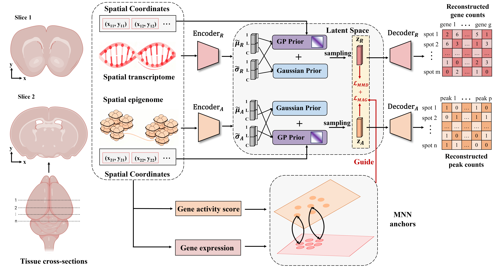

# SIVA

## Overview
SIVA (Spatially-Informed Variational Autoencoders and Anchor Guidance) is a framework for diagonal integration of spatial multi-omics data with spatial priors and anchor-guided alignment.

This repository contains the reference implementation for the manuscript:

> SIVA: Diagonal Integration of Spatial Multi-Omics Data via Spatially-Informed Variational Autoencoders and Anchor Guidance

<p align="center">
  
</p>

## 📂 Repository Structure

```text
.
├── run_SIVA.py        # Main training and evaluation entry point
├── run_SIVA.sh        # Example launch script
├── model.py           # Model definition and trainer
├── SVGP.py            # Sparse variational Gaussian process modules
├── data.py            # Dataset configuration and dataloaders
├── metrics.py         # Evaluation metrics
├── kernel.py          # Kernels for SVGP
├── distributions.py   # Data distributions
├── utils.py           
└── requirements.txt
```

## 🔧 Installation

Create a Python environment first:

```bash
conda create -n siva python=3.9
conda activate siva
pip install -r requirements.txt
```

If `scib` fails to build in your environment, try:

```bash
pip install scib --no-cache-dir --no-binary :all:
```

## 📜 Input Data

SIVA expects three input files:

1. RNA data in `.h5ad` format
2. ATAC data in `.h5ad` format
3. Anchor matrix in `.csv` format

### AnnData requirements

For each `.h5ad` file:

- `adata.obsm["spatial"]` should store spatial coordinates
- `adata.var["highly_variable"]` should be available

For RNA data specifically:

- `adata.layers["counts"]` should contain raw counts

Recommended metadata for evaluation:

- `adata.obs["histo_labels"]`: manual annotation or cell/domain labels
- `adata.obs["domain"]`: modality label used for integration metrics

### Anchor matrix requirements

The anchor `.csv` file should include columns compatible with the code path in `run_SIVA.py`. In the current implementation, the file is read and then columns are renamed as:

- `cell1` -> `rna_idx`
- `cell2` -> `atac_idx`

Anchors with `score >= 0.5` are retained during training.

## 📦 Data Availability

###  Source Data
 
- MISAR-seq: [OEP003285](https://www.biosino.org/node/project/detail/OEP003285)
- Spatial ATAC-RNA-seq: [GSE205055](https://www.ncbi.nlm.nih.gov/geo/query/acc.cgi?acc=GSE205055) or <https://brain-spatial-omics.cells.ucsc.edu>

###  Processed Data
- The processed data is freely available at:  
<https://zenodo.org/records/20034790>

## ▶️ Quick Start

Run the example shell script:

```bash
bash ./run_SIVA.sh
```

Or launch training directly:

```bash
python ./run_SIVA.py \
  --input-rna /path/to/rna.h5ad \
  --input-atac /path/to/atac.h5ad \
  --input-anchor /path/to/anchors.csv \
  --train-dir ./Results/ \
  --GP_dim 4 \
  --Normal_dim 16 \
  --inducing_point_steps 14 \
  --lam-mmd 5 \
  --lam-mag 1 \
  --random-seed 3 \
  -p
```

## ⚙️ Main Arguments

### Required inputs

- `--input-rna`: path to input RNA dataset (`.h5ad`)
- `--input-atac`: path to input ATAC dataset (`.h5ad`)
- `--input-anchor`: path to input anchor matrix (`.csv`)
- `--train-dir`: directory used to store results for all seeds

### Latent dimensions

- `--GP_dim`: dimension of the latent Gaussian process embedding
- `--Normal_dim`: dimension of the latent standard Gaussian embedding

### Model and optimization

- `--max-epochs`: maximum number of training epochs
- `--lr`: learning rate
- `--patience`: patience for early stopping
- `--data-batch-size`: minibatch size
- `--dropoutE`: encoder dropout rate
- `--dropoutD`: decoder dropout rate

### Loss weights

- `--lam-mag`: anchor guidance loss weight
- `--lam-mmd`: MMD loss weight
- `--lam-gaualign`: Gaussian alignment loss weight
- `--lam-data`: modality reconstruction weight
- `--lam-kl`: KL loss weight

### Spatial GP settings

- `--inducing_point_steps`: number of grid steps used to generate inducing points
- `--inducing_point_nums`: optional manual number of inducing points
- `--loc_range`: rescaled spatial coordinate range
- `--kernel_scale`: Gaussian process kernel scale

### Reproducibility and pairing

- `--random-seed`: number of repeated runs; the script iterates from seed `0` to `random_seed - 1`
- `-p, --paired`: marks the data as paired and enables FOSCTTM evaluation


## 📖 Citation

If you use SIVA in your work, please cite the corresponding manuscript.
